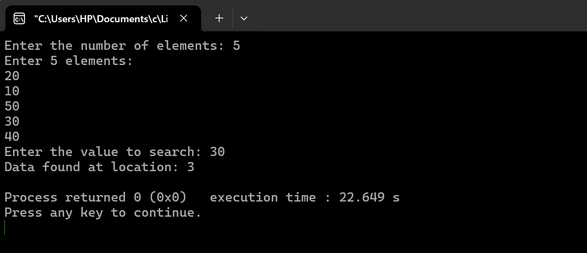

# Linear Search Algorithm 
Linear Search is a simple searching algorithm that sequentially checks each element in an array until the target element is found or the search completes.
## Algorithm (Pseudocode) 

1. Start from index i = 0 
2. Repeat until i < n (size of the array): 
   a.</b> If array[i] == search_key: 
         - Return i (found at index i) 
          
   b. Else, move to the next element 
3. If not found, return -1 (element does not exist) 

## Time Complexity Analysis : 
Best Case: 
𝑂
(
1
) (if the key is at the first index). 
Worst Case: 
𝑂
(
𝑛
)(if the key is at the last index or not present). 
Average Case: 
𝑂
(
𝑛
).
---
## Output: Linear Search

